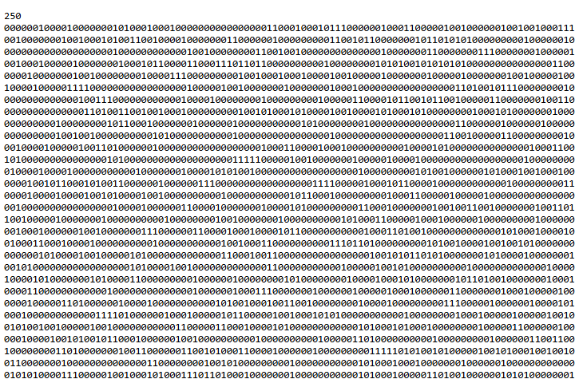
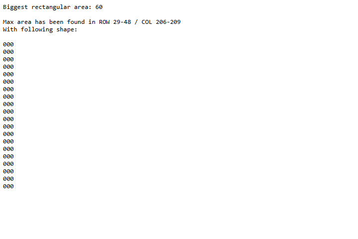
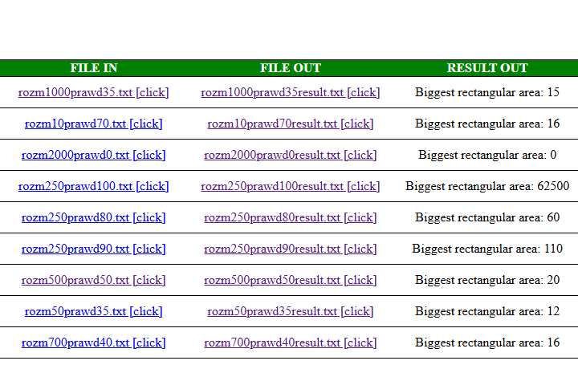
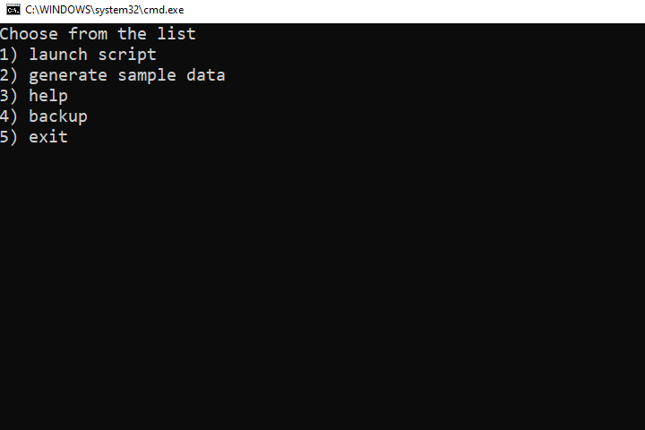

# About
## Made by Bartosz Sorek
The task was to make fast sytem that finds the biggest RECTANGULAR area in given file, file has square "plot" with zeroes and ones, script searches for biggest rectangle made of zeroes.    
The first line of file tells the number of rows and columns indicating the square "plot".    
### The python script 
Script searches for the biggest area in given text file. Script finds biggest rectangular area made of zeroes, shows the calculated result (area), bounds and shape.    
Script is quite fast and has low memory usage.
### Bat files
They are launching python scripts and creating graphical results as formated html file.     
Main file is menu.bat:
- launch script: launches script for every file that is in **IN** folder, saves results in **OUT** folder.
- generate sample data: generates random data files that serve as examples and performance testers.
- help - about
- backup - creates ZIP folder with IN, OUT and raport files
### Media
- **Input file schema**
  

---
- **Result file schema**
  

---
- **Preview in browser**
  

---
- **menu.bat**
  

